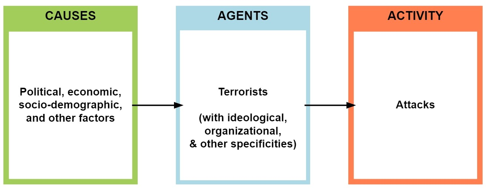
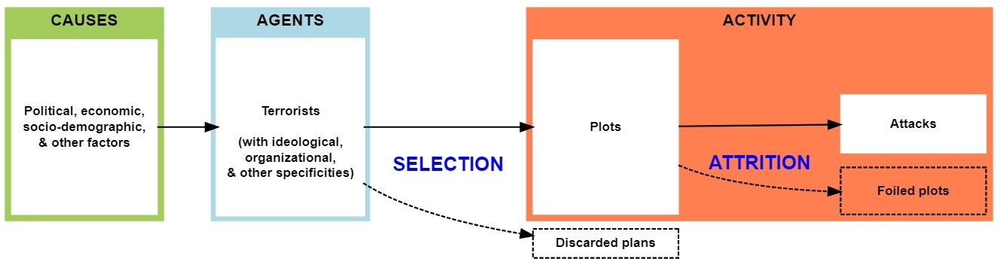

```{r setup, include=FALSE}
library(knitr)
knitr::opts_chunk$set(
  echo = FALSE,
  message = FALSE,
  warning = FALSE,
  fig.pos = "t"
  )
options(tinytex.verbose = FALSE)
```

```{r load}
# Load packages
library(tidyverse)
library(ggpubr)
library(patchwork)
library(ggplot2)
library(glue)
library(dplyr)
library(GLMMadaptive)
library(panelsummary)
library(kableExtra)
library(broom.mixed)
library(tibble)
library(sur)

# Load data
nesser <- read.csv("data/nesser_new.csv", sep = ",")
cren <- read.csv("data/crenshaw.csv", sep = ",")
poicn <- read.csv("data/poicn.csv", sep = ",")
nmonths <- read.csv("data/nesser_cym.csv", sep = ",")
cmonths <- read.csv("data/crenshaw_cym.csv", sep = ",")
```

\newpage
\clearpage
\pagenumbering{arabic} 
<!-- \linenumbers -->

# Introduction

In early September 2006, within the space of two hours, five airplanes blew up mid-air over the Atlantic, killing over 1,300 people. Days later, the militant Islamist group al-Qaida released a video claiming the attack and showing footage of the perpetrators in training. The events triggered an economic recession in Europe and ushered in a new, uglier phase in the post-9/11 War on Terrorism. 

This attack never happened. But it could have, because in 2009, four men were sentenced in a British court to life in prison for having attempted it. Surveillance and searches showed the men to have been in possession of explosives, to have recorded martyrdom videos, and to have identified seven U.S. and Canada-bound flights for their operation [@cruickshank2014airline;@nesser2018islamist: 190-198]. They had devised a new technique to get bombs on airplanes: bring the *ingredients* in soda cans and assemble the device onboard after takeoff. This one plot is the reason why you still cannot bring liquids in containers of more than 100 ml on an airplane. 

If we wanted to assess the terrorist activity level in Europe in the mid-2000s, it would make sense to take the 2006 Airliner Plot into consideration. However, because it did not reach execution, it does not feature in the terrorism event datasets that academics use to study terrorism quantitatively. The same is true of hundreds, if not thousands, of other foiled plots around the world in recent decades. In this article, we ask whether it matters for our knowledge about terrorism that near-misses are excluded from event datasets.

Counting attacks seems like a sensible and uncontroversial approach to measuring terrorism. But attacks are only the subset of terrorist activity that happen to reach execution. Many plots are foiled by police or derail for other reasons, never to enter terrorism datasets. In the following, we build on recent advances in plot data collection to conduct the first systematic examination of this potential measurement problem. We show that, while the incidence of plots and attacks are often highly correlated, they differ enough to potentially produce statistically different results in common study designs. Answers to the question "what causes terrorism" can therefore vary depending on how one operationalizes terrorist activity.

The inquiry matters because attack counts are central to the study of terrorism. A large proportion of quantitative studies on terrorism measure terrorist activity in executed attacks or their derivatives (such as casualties). The most widely used dataset by far is the Global Terrorism Database (GTD) [@lafree2007introducing], which is explicit about only including attacks.[^explicit] The other main terrorism dataset, ITERATE [@mickolus2022iterate], includes foiled plots, but registers so few that it is arguably an attack dataset in practice.[^iterate] GTD alone underpins thousands of studies into the causes and consequences of terrorism.[^proportions] The accuracy of this knowledge hinges on executed attacks being a reasonably valid measure of terrorist activity.

[^explicit]: \hspace{0.5mm} The GTD Codebook [@gtd2021codebook: 13] says, "The GTD does not include plots or conspiracies that are not enacted, or at least attempted. For an event to be included in the GTD, the attackers must be 'out the door,' en route to execute the attack. Planning, reconnaissance, and acquiring supplies do not meet this threshold."

[^iterate]: \hspace{0.5mm} ITERATE codes for a variable called "Terrorist logistical success" [@iterate2021codebook: 66] with eight values, the first three of which capture foiled plots as understood in this article: "0: Aborted by terrorists before initiation", "1: Incident stopped by authorities at planning stage", and "3: Incident stopped by authorities at scene or on the way to scene, before initiation". While ITERATE should be applauded for its empirical accounting of plots, the actual number of plot counts that it records is very low. Benchmarking it to plots reported in Nesser for Europe leads us to suspect systematic underreporting (see Appendix Section 8).

[^proportions]: \hspace{0.5mm} There are several other less widely used datasets too; See Johnson and Ackerman [-@johnson2023terrorism] for an overview. The same work (p. 164) provides an indication of relative prevalence: "a basic search by database name of Google Scholar reveals 950 scholarly works using the ITERATE database, 550 using WITS data, 43 using the LEADIR database and a whopping 8,350 using the GTD."

Scholars have studied foiled plots, but not their statistical dimensions. The literature on plots has focused on the history of specific groups [@nesser2018islamist], the features of the plot preparation process [@cothren2008geospatial;@kaplan2012estimating;@gruenewald2019suspicious] and why some plots fail and others succeed [@mccleskey2007underlying;@jackson2009understanding;@strom2010building;@gruenewald2019american]. Several researchers have noted that attacks can misrepresent terrorist activity [@sageman_confronting_2009: 5; @crenshaw_tip_2017: 69], but the broader epistemological implications of this observation have not been explored. Meanwhile, the literature on measurement problems in terrorism research has barely noted the concern raised by foiled plots [@mickolus_how_2002;@young_promise_2011;@sheehan2011assessing;@freilich_future_2015;@dugan_measuring_2016;@freilich_measurement_2016].

This article is the first to systematically examine the statistical relationship between plots and attacks. While some of the abovementioned studies have explored this relationship for small incident samples, we examine all the available multi-year and multi-country plot datasets in the hope of extracting more generalizeable insights. To do this, we exploit recent advances in plot data collection that provide fine-grained data on plots by jihadi groups in the West and on chemical, biological, radiological and nuclear (CBRN) plots worldwide over the last quarter-century. We then conduct two tests: first, we study the association between plot and attack counts in all the datasets across different temporal units and functional forms; second, we set up a plausible study of jihadi terrorism in Europe and compare how covariates of theoretical interest predict the incidence of plots and attacks. Our objective is to establish whether the correlates of plots are statistically different from the correlates of attacks in country panel studies of terrorism. 

We find that they are. While the correlation between plots and attacks is relatively high, it varies across different units of analysis and functional forms. More importantly, we get statistically different estimates across a range of covariates when predicting the incidence of jihadi terrorism in Western Europe, depending on whether we use plot or attack data as the outcome. This is after adjusting for security spending, suggesting that there is no modelling quick fix to the measurement problem. Finally, we show that if scholars want to study the incidence of terrorist attacks, they should consider a two-step process that takes into account the number of plots that failed. Taken together, the findings suggest that plots should be taken seriously as a measure of terrorist activity and that political scientists studying other phenomena should pay attention to precursor events.

# Conceptual framework

We start by specifying the conceptual relationship between plots and attacks. Since our perspective is new, we describe what we see as the prevailing approach to terrorism measurement before presenting our alternative framework.

## The standard view: Terrorist activity as attacks

Political scientists have searched for the causes of terrorism with quantitative methods for over forty years [@mickolus_statistical_1977]. In the now substantial literature, the typical approach consists of examining the statistical relationship between theoretically relevant covariates and the incidence of terrorism.

Most studies examine country-level variables [@sandler_2014_analytical;@morris_country-level_2017], and scholars have estimated the effect on terrorism of a long list of factors, notably[^sample]:

[^sample]: \hspace{0.5mm} This list is not exhaustive. Other studies examine more specific factors, while yet others explore batteries of dozens of covariates in search of terrorism's correlates [@gassebner_lock_2011;@kis-katos_origin_2011;@krieger_what_2011;@demir2022predictors].

- Regime type [@eubank_terrorism_2001;@li_does_2005;@savun_democracy_2009;@chenoweth_terrorism_2013;@gaibulloev_regime_2017] 
- Demographics [@choi_no_2013;@milton_radicalism_2013;@bove_does_2016;@helbling2020terrorism] 
- Economic conditions [@blomberg_economic_2004;@li_economic_2004;@keefer2008terrorism;@caruso_socio-economic_2011;@freytag_origins_2011]
- Poverty and inequality [@krueger_education_2003;@abadie_poverty_2006;@piazza_rooted_2006;@enders2016changing;@franc_inequality_2023] 
- State capacity [@newman_weak_2007;@lai_draining_2007;@piazza_incubators_2008;@tikuisis_relationship_2009;@dreher_government_2010;@danzell_does_2013;@daxecker2013repression;@coggins_does_2015;@george_state_2018]
- Domestic policy [@burgoon_welfare_2006;@koch_testing_2007;@walsh_why_2010]
- Political stability [@campos_international_2013;@fahey_does_2015;@schumacher_does_2019] 
- Foreign policy [@neumayer2009international;@kattelman2020assessing] 
- Culture [@gelfand_culture_2013;@bohmelt2020does].

The substantive findings in these works are numerous, and on any given topic there is a rich, nuanced, and sometimes contested literature. We choose not to summarise the substantive discussions here because our concern is not the findings themselves, but rather how they are operationalizing terrorist activity.      

The literature exemplified by this list is not marginal. Attack counting arguably represents the dominant approach to the study of terrorism in political science. Unlike qualitative studies, which tend to appear in specialist terrorism journals, country-year panel studies have featured in the leading journals of political science and economics, and have attracted thousands of citations. 

Practically all of these studies measure the incidence of terrorism in attacks only. They frequently refer to the dependent variable as "terrorism" --- implying "terrorist activity" --- but operationalize it exclusively as counts of executed attacks. Most do not control for measures of counterterrorism capacity, suggesting that plot attrition has not been a theoretical concern. The existing literature has effectively elided terrorist activity and executed terrorist attacks.

Moreover, the metrics used in many other quantitative research designs are derivatives of attack counts. Suicide terrorism, for example, is studied as a subset of executed attacks [@pape_strategic_2003;@wade_does_2007;@horowitz2010nonstate]. Casualty counts are necessarily based on consummated attacks [@asal2008nature;@sanchez-cuenca_revolutionary_2009]. Group-level tactical preferences are usually inferred from distributions of executed attacks [@brandt_what_2010;@horowitz_tactical_2018], and spatial diffusion of terrorism likewise [@polo_how_2020]. Some studies that take individuals as the unit of analysis --- to study what makes people become terrorists --- also draw their sample from attack perpetrators [@weinberg2003social;@lankford2011columbine]. 

Not all quantitative studies use dependent variables derived from attacks. Many individual-level studies examine group, movement, or plot participants [@bakker_jihadi_2006;@cerinacasecontrol2023;@krueger_what_2007;@lee_who_2011], thus sampling beyond just attack perpetrators. Some country-level designs include terrorist group emergence [@chenoweth_democratic_2010] or group fate [@carter2012blessing] as outcome variables. But in the overwhelming majority of quantitative terrorism studies, the dependent variable is executed attacks or a derivative of it.

The existing approach to terrorism measurement is arguably based on an implicit understanding of a terrorism production chain with three ideal-type stations: causes, agents, and activity (see Figure \ref{fig:prodchain1}). First are the underlying causes, typically operationalized as societal features such as regime type or GDP. Second are the agents, who emerge due to the contextual factors and instigate the violence; they are usually studied through group traits such as ideology or organizational structure. Third is the resulting activity, nearly always operationalized as executed attacks. It is this last "activity box" that we wish to unpack.

\newpage

```{r flow1, echo=FALSE, fig.cap="\\label{fig:prodchain1} The terrorism production chain as commonly conceptualized", fig.pos="h", out.width="60%"}



```

## Our suggestion: Terrorist activity as attacks and plots

We propose to widen the notion of terrorist activity to include both plots and attacks. Given the well-documented phenomenon of plot derailment, attack counts must underreport terrorist activity at least some of the time. We therefore suggest conceptualizing plots as an event type that can be used to measure terrorist activity alongside attack counts.

We posit that all terrorist attacks require at least some degree of preparation; i.e., that they are preceded by a process that takes an operational idea from the abstract to the tangible. At some point in the process, the operational plan will become sufficiently specific and viable to be considered a "plot". A plot is an operational plan that is developed enough to produce an attack absent any subsequent external intervention. 

\newpage

```{r flow2, echo=FALSE, fig.cap="\\label{fig:prodchain2}The terrorism production chain, disaggregated", fig.pos="h", out.width="110%"}



```

Not all aspirations become executed attacks. A scaling off occurs, whereby some plans are discarded, prevented, or botched before reaching execution. Multiple factors contribute to the scaling off, but we distinguish between two ideal types of mechanisms -- choices and externalities -- and divide the production chain correspondingly into two stages. First is the selection stage, where terrorists evaluate operational ideas based on feasibility, discarding some and pursuing others. The latter become plots. Second is the attrition stage, where terrorists try to turn the plots into attacks, only to see some fail for unanticipated reasons, such as police intervention, technical problems, or mistakes. Figure \ref{fig:prodchain2} visualises our reconceptualization of the terrorism production chain. 

Plots are thus events on a par with attacks, but they provide a different measure of terrorist activity. Plot counts reflect the *gross* activity level, while attack counts measure the net. The gross level is of scientific interest because it represents the pre-treatment version of the phenomenon at hand. The net level, by contrast, has been reduced by counterterrorism and other intervening factors. Plots are not a perfectly pristine measure of terrorist activity, because terrorism is a strategic game in which countermeasures probably affect terrorists' choices about which plots to pursue. Still, plot counts are less contaminated by intervening variables than attack counts.

Given that all attacks were once plots, we see no reason why plot counts would not be generated by the same causal processes --- and thus be drawn from the same underlying distribution --- as attacks. The only thing that distinguishes plot production from attack production is the late-stage intervening factors that foil plots. These intervening variables are of theoretical interest, but they can only be studied if we know the gross activity level. When we regress attack counts on broad country features such as GDP, as most studies do, we have no way of distinguishing between motivational and constraint-based determinants.

Note that we draw a distinction between *plans* (or aspirations) and *plots*. Plots are the subset of plans that are selected by terrorists for implementation. Discarded or abandoned plans are not plots by definition, and the causal process behind plans is likely different from that of plots and attacks.[^late_stage] This is not least because, in the plan-to-plot stage, state deterrence comes into play, bringing in a game-theoretic dimension to the decision-making. In the plot-to-attack stage, by contrast, only externalities affect the outcome. This article deals only with the plot-attack relationship, as the plan-plot relationship is more complex and requires separate treatment.

[^late_stage]: \hspace{0.5mm} There are cases of "abandoned plots", i.e., serious operational intentions that are called off in the last moment. But they are rare; Crenshaw et al [-@crenshaw_comparing_2017: 22] observe that, out of their 121 cases, "Very few attempts failed completely, independent of external intervention, because of some mistake or reluctance on the part of the perpetrators (six, to be exact)". Moreover, this type of abandonment appears to mostly involve attackers on the sharp end changing their mind; as such, they represent tactical, not strategic, abandonment, i.e., a type of externality that the strategic planners did not intend and could not foresee, and hence not conceptually very different from other externalities such as police intervention or bystander meddling. With so called lone wolf attackers, this distinction is admittedly blurred, but true lone wolves are rare. 

A final reason to study plots is that the plot attrition rate -- the percentage of plots in a given place-time unit that fail to reach execution -- appears to vary in time and space. Crenshaw et al [-@crenshaw_jihadist_2017: 34-35] found the attrition rate for jihadi plots in nine Western countries between 2010 and 2016 to vary between 38 and 89 percent across countries and between 47 to 93 percent across years. Strom et al [-@strom_2015terrorist: 8] found that, for terrorism in the USA from 1995 to 2012, the yearly attrition rate varied between 10 and 100 percent. 

We currently know little about the determinants of this variation, and herein lies the potential for a measurement problem. If the rate varies in ways we cannot account for, then we cannot infer the gross activity level from the attack count. Glaciologists can predict the size of the submerged part of an actual iceberg (it is around ninety percent), but for our figurative icebergs, we do not know how much ice is below the waterline. 

# Plot data

While the notion of plot may be conceptually intuitive, it is less obvious how it can be used to generate reliable data about terrorist activity. The fundamental problem is observability: while attacks cause physical damage in public, plots are unconsummated intentions. We contend that plots can still be observed because they need to leave the realm of thought in at least one of two ways: verbal articulation and practical preparation. We therefore operationalize the term plot as 1) a plan to deploy violence 2) of which a key feature has been verbally articulated and 3) for which observable preparatory steps have been taken. 

In practice, it can be hard to identify plots consistently. Given the range of tactical possibilities in terrorism, there are no hard-and-fast rules for what constitutes a compromising statement or preparatory step, which leaves room for interpretation. Foiled plots attract less media attention than attacks, leaving less of a reporting trail for dataset-builders to follow, especially when the plot is foiled covertly and those involved do not go to trial. Public information on alleged foiled plot cases is vulnerable to biases such as media sensationalism and selective leaks from government investigators. In addition, national media might pay more attention to one type of terrorism than another depending on the political situation or the ideological leanings of the dominant media. One way of mitigating media bias is to include only plots that went to trial and resulted in conviction; this is the approach taken in the Crenshaw dataset (see below) and, with a few exceptions, in the Nesser dataset (also below). However, the availability of reliable case evidence depends on the existence of trustworthy police, independent judiciaries, and a free media. This means that in authoritarian countries, information regarding alleged plots should be treated with severe caution, and it is probably not possible to construct plot datasets for such countries at all. To these plot-specific problems must be added the general challenges faced by compilers of incident data, such as geographical and chronological reporting biases (more on this below). On the whole, there are unquestionably more potential sources of noise in plot data than in attack data.

We still argue that systematic plot data are not fundamentally elusive, just difficult to obtain. In some contexts, such as Western democracies in the digital age, the amount of open source information about political activism is so substantial that reasonably reliable plot data can be generated. But they are more labor-intensive to compile than attack datasets, and some areas and time periods might never be covered for lack of reliable sources. This is why existing plot data have tended to cover limited time periods and areas.[^other]

Recently, however, three larger and more comprehensive plot datasets have become available. These are Nesser's [-@nesser2023] data on jihadi plots in Western Europe 1994-2021 (henceforth "Nesser"), Crenshaw et al's [-@crenshaw_comparing_2017] data on jihadi plots in the West 1993-2017 (henceforth "Crenshaw"), and the POICN [@binder2019pick] dataset on CBRN plots worldwide 1990-2017 (henceforth "POICN"). Together, they form the universe of available plot datasets that cover multiple years and countries.

[^other]: \hspace{0.5mm} Existing plot datasets typically cover a single type of terrorism in a single country: @bromund2009islamist, @bjelopera_2010, @simcox_2011, @beutel_2012, @jenkins_2017, @adl_homegrown_2018, @heritage_2018, @mueller_2019, and @gratrud2023. Some cover a single type in several countries but over short timespans (3-15 years): @bakker_jihadi_2006, @jenkins_2006, @boyd_2008, @sageman_confronting_2009, @hsc_2016, @beuze_terrorist_2017, and @simcox_2017. A few cover all terrorism over long timespans but in a single country: @strom_2015terrorist, @ats_2018, and @ecdb_2019. Another (@dahl2011plots) covers the world over 23 years but for a very narrow type (jihadi terrorism directed at US targets). We considered including @ravndal2022, which covers far-right terrorism in Europe since 1990, but its plot inclusion criteria are stricter than those of our three datasets, making comparison difficult.\vspace{0.5mm}

We consider all three datasets relatively reliable because they were compiled by academics who used largely the same procedures as other incident datasets and who discussed their inclusion criteria in depth (see Appendix Section 1 for details). We trust POICN despite its coverage of authoritarian countries because CBRN incidents attract special international scrutiny. The data generation process for plot data and attack data is the same as far as the collection procedure is concerned, although there may be slight differences in their respective sets of reporting biases.

We recognize that plot data are imperfect, but their flaws must be put in perspective. Global attack datasets are known to contain severe geographical reporting biases, yet scholars still use them. Behlendorf et al [-@behlendorf2016peering] compared GTD data with local police data from a region in India and found that GTD recorded only two percent of the terrorist attacks recorded by police. A similar study on Turkey [@cubukcu2018measuring] found that GTD only contained three percent of the attacks recorded by local authorities. Whatever reporting biases exist in plot data from contemporary Western democracies, they are almost certainly less severe than this. And GTD contains other biases, too, such as that stemming from its particular definition of terrorism [@kaczkowski2022definitions;@mccann2023who] or the chronological one stemming from the switch to automated data collection in 2011, which led to a significant increase in globally reported incidents from one year to another [@jensen2013discussion].

In the following, we use Nesser, Crenshaw, and POICN to study the relationship between plots and attacks. Each dataset codes for execution, thus providing us with both plot and attack counts (see Appendix Section 3 for summary statistics). We examine the plot-attack relationship internal to each dataset and compare the results across them.[^processing] For all their limitations, these datasets offer the best available basis to explore the plot-attack relationship. As noted, there are no other reliable plot datasets covering multiple decades and countries, so our inquiry arguably exhausts the current possibilities for empirical testing. 

[^processing]: \hspace{0.5mm} We cleaned and reprocessed the datasets to make them comparable; see the Appendix Section 2 for details. \vspace{0.5mm}
  
# The relationship between plots and attacks

We have suggested that attack data can underestimate terrorist activity. Given the difficulty of collecting plot data, the question is whether these two measures even out when many events are aggregated across space and time.

```{r corr_units, echo=FALSE, warning = FALSE, message = FALSE, fig.height=6, fig.width=7.5, fig.pos="t", fig.cap = "\\label{fig:corr_units} Bivariate correlations by units of analysis"} 

# Recurring graphical element ----------------------------------------

style <- theme(axis.line = element_line(),
        panel.background = element_blank(),
        axis.title = element_text(size = (8)),
        plot.title = element_text(size = 8, face = "bold", hjust = 0.5),
        axis.text.x = element_blank(),
        axis.ticks.x = element_blank(),
        axis.text.y = element_blank(),
        axis.ticks.y = element_blank())

# Nesser --------------------------------------------------------------------------------

countries <- nesser %>%
  group_by(country) %>%
  summarise(launched = sum(launched), all = sum(all))
years <- nesser %>%
  group_by(year) %>%
  summarise(launched = sum(launched), all = sum(all))

# Ns
ncountries <- nrow(countries)
nyears <- nrow(years)
ncy <- nrow(nesser)
ncm <- nrow(nmonths)

method1 <- "pearson"
coefname1 <- "r"
method2 <- "spearman"
coefname2 <- "rho"
xnpc1 <- .07
xnpc2 <- .07
ynpc1 <- .9
ynpc2 <- .7
size <- 5.5
r_acc <- .01

# Nesser - by country
panel_1 <- ggplot(countries, aes(launched, all)) +
  geom_jitter(colour = "magenta", size = 2, alpha = 0.3, width = 2) +
  geom_smooth(method = lm, lty = 2, colour = "black", size = 0.5, se = FALSE) +
  labs(title = glue("Country (n={ncountries})"), x = "", y = "") +
  stat_cor(aes(label = ..r.label..), label.x.npc = xnpc1, label.y.npc = 1,
           method = method1, cor.coef.name = coefname1, r.accuracy = r_acc, size = size) +
  stat_cor(aes(label = ..r.label..), label.x.npc = xnpc2, label.y.npc = .8,
           method = method2, cor.coef.name = coefname2, r.accuracy = r_acc, size = size) +
  style

# Nesser - by year
panel_2 <- ggplot(years, aes(launched, all)) +
  geom_jitter(colour = "magenta", size = 2, alpha = 0.3, width = 1) +
  geom_smooth(method = lm, lty = 2, colour = "black", size = 0.5, se = FALSE) +
  labs(title = glue("Year (n={nyears})"), x = "", y = "") +
  stat_cor(aes(label = ..r.label..), label.x.npc = xnpc1, label.y.npc = ynpc1,
           method = method1, cor.coef.name = coefname1, r.accuracy = r_acc, size = size) +
  stat_cor(aes(label = ..r.label..), label.x.npc = xnpc2, label.y.npc = ynpc2,
           method = method2, cor.coef.name = coefname2, r.accuracy = r_acc, size = size) +
  style

# Nesser - by country year
panel_3 <- ggplot(nesser, aes(launched, all)) +
  geom_jitter(colour = "magenta", size = 2, alpha = 0.3, width = 1) +
  geom_smooth(method = lm, lty = 2, colour = "black", size = 0.5, se = FALSE) +
  labs(title = glue("Country year (n={ncy})"), x = "", y = "") +
  stat_cor(aes(label = ..r.label..), label.x.npc = .001, label.y.npc = .95,
           method = method1, cor.coef.name = coefname1, r.accuracy = r_acc, size = size) +
  stat_cor(aes(label = ..r.label..), label.x.npc = .001, label.y.npc = .75,
           method = method2, cor.coef.name = coefname2, r.accuracy = r_acc, size = size) +
  style

# Nesser - by country month
panel_4 <- ggplot(nmonths, aes(launched, all)) +
  geom_jitter(colour = "magenta", size = 2, alpha = 0.3, width = 0.5) +
  geom_smooth(method = lm, lty = 2, colour = "black", size = 0.5, se = FALSE) +
  labs(title = glue("Country month (n={ncm})"), x = "", y = "") +
  stat_cor(aes(label = ..r.label..), label.x.npc = .001, label.y.npc = .98,
           method = method1, cor.coef.name = coefname1, r.accuracy = r_acc, size = size) +
  stat_cor(aes(label = ..r.label..), label.x.npc = .001, label.y.npc = .78,
           method = method2, cor.coef.name = coefname2, r.accuracy = r_acc, size = size) +
  style

# Combining the panels to a row
row_1 <- ggarrange(panel_1, panel_2, panel_3, panel_4, ncol = 4, nrow = 1, heights = c(0.5, 0.5, 0.5, 0.5)) %>%
  annotate_figure(left = text_grob("Nesser     ", face = "bold", size = 11))

# Crenshaw --------------------------------------------------------------------------------

countries <- cren %>%
  group_by(country) %>%
  summarise(launched = sum(launched), all = sum(all))
years <- cren %>%
  group_by(year) %>%
  summarise(launched = sum(launched), all = sum(all))

# Ns
ncountries <-  nrow(countries)
nyears <- nrow(years)
ncy <- nrow(cren)
ncm <- nrow(cmonths)

# Crenshaw - by country
panel_5 <- ggplot(countries, aes(launched, all)) +
  geom_jitter(colour = "dodgerblue", size = 2, alpha = 0.3, width = 2) +
  geom_smooth(method = lm, lty = 2, colour = "black", size = 0.5, se = FALSE) +
  labs(title = glue("Country (n={ncountries})"), x = "", y = "Plots") +
  stat_cor(aes(label = ..r.label..), label.x.npc = xnpc1, label.y.npc = ynpc1,
           method = method1, cor.coef.name = coefname1, r.accuracy = r_acc, size = size) +
  stat_cor(aes(label = ..r.label..), label.x.npc = xnpc2, label.y.npc = ynpc2,
           method = method2, cor.coef.name = coefname2, r.accuracy = r_acc, size = size) +
  style

# Crenshaw - by year
panel_6 <- ggplot(years, aes(launched, all)) +
  geom_jitter(colour = "dodgerblue", size = 2, alpha = 0.3, width = 1) +
  geom_smooth(method = lm, lty = 2, colour = "black", size = 0.5, se = FALSE) +
  labs(title = glue("Year (n={nyears})"), x = "", y = "") +
  stat_cor(aes(label = ..r.label..), label.x.npc = xnpc1, label.y.npc = ynpc1,
           method = method1, cor.coef.name = coefname1, r.accuracy = r_acc, size = size) +
  stat_cor(aes(label = ..r.label..), label.x.npc = xnpc2, label.y.npc = ynpc2,
           method = method2, cor.coef.name = coefname2, r.accuracy = r_acc, size = size) +
  style

# Crenshaw - by country year
panel_7 <- ggplot(cren, aes(launched, all)) +
  geom_jitter(colour = "dodgerblue", size = 2, alpha = 0.3, width = 1) +
  geom_smooth(method = lm, lty = 2, colour = "black", size = 0.5, se = FALSE) +
  labs(title = glue("Country year (n={ncy})"), x = "", y = "") +
  stat_cor(aes(label = ..r.label..), label.x.npc = xnpc1, label.y.npc = ynpc1,
           method = method1, cor.coef.name = coefname1, r.accuracy = r_acc, size = size) +
  stat_cor(aes(label = ..r.label..), label.x.npc = xnpc2, label.y.npc = ynpc2,
           method = method2, cor.coef.name = coefname2, r.accuracy = r_acc, size = size) +
  style

# Crenshaw by country months
panel_8 <- ggplot(cmonths, aes(launched, all)) +
  geom_jitter(colour = "dodgerblue", size = 2, alpha = 0.3, width = 0.5) +
  geom_smooth(method = lm, lty = 2, colour = "black", size = 0.5, se = FALSE) +
  labs(title = glue("Country month (n={ncm})"), x = "", y = "") +
  stat_cor(aes(label = ..r.label..), label.x.npc = xnpc1, label.y.npc = ynpc1,
           method = method1, cor.coef.name = coefname1, r.accuracy = r_acc, size = size) +
  stat_cor(aes(label = ..r.label..), label.x.npc = xnpc2, label.y.npc = ynpc2,
           method = method2, cor.coef.name = coefname2, r.accuracy = r_acc, size = size) +
  style

# Combining the panels to a row
row_2 <- ggarrange(panel_5, panel_6, panel_7, panel_8, ncol = 4, nrow = 1) %>%
 annotate_figure(left = text_grob("Crenshaw", face = "bold", size = 11))

# POICN --------------------------------------------------------------------------------

poicn$all <- poicn$launched + poicn$foiled
countries <- poicn %>%
  group_by(iso2c) %>%
  summarise(launched = sum(launched), all = sum(all))
years <- poicn %>%
  group_by(year) %>%
  summarise(launched = sum(launched), all = sum(all))

# Ns
ncountries <-  nrow(countries)
nyears <- nrow(years)
ncy <- nrow(poicn)

# POICN - by country
panel_9 <- ggplot(countries, aes(launched, all)) +
  geom_jitter(colour = "green", size = 2, alpha = 0.2, width = 2) +
  geom_smooth(method = lm, lty = 2, colour = "black", size = 0.5, se = FALSE) +
  labs(title = glue("Country (n={ncountries})"), x = "", y = "") +
  stat_cor(aes(label = ..r.label..), label.x.npc = xnpc1, label.y.npc = ynpc1,
           method = method1, cor.coef.name = coefname1, r.accuracy = r_acc, size = size) +
  stat_cor(aes(label = ..r.label..), label.x.npc = xnpc2, label.y.npc = ynpc2,
           method = method2, cor.coef.name = coefname2, r.accuracy = r_acc, size = size) +
  style

# POICN - by year
panel_10 <- ggplot(years, aes(launched, all)) +
  geom_jitter(colour = "green", size = 2, alpha = 0.2, width = 1) +
  geom_smooth(method = lm, lty = 2, colour = "black", size = 0.5, se = FALSE) +
  labs(title = glue("Year (n={nyears})"), x = "Attacks", y = "") +
  stat_cor(aes(label = ..r.label..), label.x.npc = xnpc1, label.y.npc = ynpc1,
           method = method1, cor.coef.name = coefname1, r.accuracy = r_acc, size = size) +
  stat_cor(aes(label = ..r.label..), label.x.npc = xnpc2, label.y.npc = ynpc2,
           method = method2, cor.coef.name = coefname2, r.accuracy = r_acc, size = size) +
  style

# POICN - by country year
panel_11 <- ggplot(poicn, aes(launched, all)) +
  geom_jitter(colour = "green", size = 2, alpha = 0.2, width = 1) +
  geom_smooth(method = lm, lty = 2, colour = "black", size = 0.5, se = FALSE) +
  labs(title = glue("Country year (n={ncy})"), x = "", y = "") +
  stat_cor(aes(label = ..r.label..), label.x.npc = xnpc1, label.y.npc = 1,
           method = method1, cor.coef.name = coefname1, r.accuracy = r_acc, size = size) +
  stat_cor(aes(label = ..r.label..), label.x.npc = xnpc2, label.y.npc = .8,
           method = method2, cor.coef.name = coefname2, r.accuracy = r_acc, size = size) +
  style

# Combining the panels to a row
row_3 <- ggarrange(panel_9, panel_10, panel_11, ncol = 4, nrow = 1) %>%
 annotate_figure(left = text_grob("POICN      ", face = "bold", size = 11))

# Combining the three rows into grid ----------------------------------------
ggarrange(row_1, row_2, row_3, ncol = 1, nrow = 3)
```

Figure \ref{fig:corr_units} shows the relationship between plots and attacks when assigned to different units of analysis. We report associations as measured by both Pearson's r and Spearman's $\rho$. Aggregating to the country produces the strongest associations. Note, however, that the association between launched attacks and plots varies considerably when examining the across-country association on a year-by-year basis (see Appendix, Figures A4.1-4.3). We also find strong associations when aggregating to the year. This has positive implications for descriptive studies that aggregate attack counts to large geographic or temporal units.

The relationship between launched attacks and plots is, however, attenuated when observing different countries over multiple units of time in a panel structure. When assigned to the country year, the typical observation in quantitative studies of terrorism, launched attacks and plots remain positively correlated, but the association is weakened. This is especially pronounced when measured using Spearman's $\rho$, which does not assume linearity and is less sensitive to outliers. Disaggregation to smaller units of time attenuates the association further. Confining attention to Nesser and Crenshaw's datasets, which allow for assignment to the country month, the association between plots and attacks remains positive, but is substantively diminished. Temporal disaggregation is important. Researchers often want to capture the effects of time-varying covariates --- e.g. the impact of government policies at time *t-1* on the incidence of terrorism at time *t*. But as our bivariate correlations show, attacks provide only a rough approximation of the intensity of terrorist activity in a country at a given point in time.

Another relevant consideration relates to functional form. Terrorism is a rare event: most countries will see few if any attacks or plots in a given year. In consequence, both launched attacks and plots follow heavy-tailed distributions: the modal observation is zero, while most events are concentrated in just a few units (see Appendix, Figure A5 for histograms). To minimize the influence of outliers, applied researchers often look to reduce the size of this tail by using different functional forms. Figure \ref{fig:corr_func} shows how the association between launched attacks and plots in a country year varies by taking the square root and the inverse hyperbolic sine. The relevant comparison is the unbounded count of events in a country year reported in \ref{fig:corr_units}. In all three datasets, we see that reducing the influence of outliers further attenuates the association between plots and attacks when measured using Pearson's r, as compared to an unbounded count. Applied researchers are also often interested in examining how the incidence of terrorism compares across spatial units that vary by population. Taking the per capita rate, we see that the correlation between launched attacks and plots is typically weakened across all three datasets.

```{r corr_func, echo=FALSE, warning = FALSE, message = FALSE, fig.height=6, fig.width=7.5, fig.pos="t", fig.cap = "\\label{fig:corr_func} Bivariate correlations by functional form"}

# Nesser ----------------------------------------

# Transforming variables
nesser$launched_sqr <- sqrt(nesser$launched)
nesser$all_sqr <- sqrt(nesser$all)
nesser$launched_invsine <- asinh(nesser$launched)
nesser$all_invsine <- asinh(nesser$all)
nesser$launched_percap <- nesser$launched / (nesser$population * nesser$percentagemuslims / 100000)
nesser$all_percap <-  nesser$all / (nesser$population * nesser$percentagemuslims / 100000)

# Nesser - square root transformation
panel_1 <- ggplot(nesser, aes(launched_sqr, all_sqr)) +
  geom_point(colour = "magenta", size = 2, position = "jitter", alpha = 0.3) +
  geom_smooth(method = lm, lty = 2, colour = "black", size = 0.5, se = FALSE) +
  labs(title = "Square root", x = "", y = "") +
  stat_cor(aes(label = ..r.label..), label.x.npc = xnpc1, label.y.npc = ynpc1,
           method = method1, cor.coef.name = coefname1, r.accuracy = r_acc, size = size) +
  stat_cor(aes(label = ..r.label..), label.x.npc = xnpc2, label.y.npc = ynpc2,
           method = method2, cor.coef.name = coefname2, r.accuracy = r_acc, size = size) +
  style

# Nesser - inverse hyperbolic sine transformation
panel_2 <- ggplot(nesser, aes(launched_invsine, all_invsine)) +
  geom_point(colour = "magenta", size = 2, position = "jitter", alpha = 0.3) +
  geom_smooth(method = lm, lty = 2, colour = "black", size = 0.5, se = FALSE) +
  labs(title = "Inverse hyperbolic sine", x = "", y = "") +
  stat_cor(aes(label = ..r.label..), label.x.npc = xnpc1, label.y.npc = ynpc1 + .08,
           method = method1, cor.coef.name = coefname1, r.accuracy = r_acc, size = size) +
  stat_cor(aes(label = ..r.label..), label.x.npc = xnpc2, label.y.npc = ynpc2 + .08,
           method = method2, cor.coef.name = coefname2, r.accuracy = r_acc, size = size) +
  style

# Nesser - per capita adjustment
panel_3 <- ggplot(nesser, aes(launched_percap, all_percap)) +
  geom_point(colour = "magenta", size = 2, position = "jitter", alpha = 0.3) +
  geom_smooth(method = lm, lty = 2, colour = "black", size = 0.5, se = FALSE) +
  labs(title = "Per capita rate", x = "", y = "") +
  stat_cor(aes(label = ..r.label..), label.x.npc = xnpc1, label.y.npc = ynpc1,
           method = method1, cor.coef.name = coefname1, r.accuracy = r_acc, size = size) +
  stat_cor(aes(label = ..r.label..), label.x.npc = xnpc2, label.y.npc = ynpc2,
           method = method2, cor.coef.name = coefname2, r.accuracy = r_acc, size = size) +
  style

# Combining the panels to a row
row_1 <- ggarrange(panel_1, panel_2, panel_3, ncol = 4, nrow = 1) %>%
 annotate_figure(left = text_grob("Nesser     ", face = "bold", size = 11))

# Crenshaw ----------------------------------------

# Transforming variables
cren$launched_sqr <- sqrt(cren$launched)
cren$all_sqr <- sqrt(cren$all)
cren$launched_invsine <- asinh(cren$launched)
cren$all_invsine <- asinh(cren$all)
cren$launched_percap <- cren$launched / (cren$population * cren$percentagemuslims / 100000)
cren$all_percap <-  cren$all / (cren$population * cren$percentagemuslims / 100000)

# Crenshaw - square root transformation
panel_4 <- ggplot(cren, aes(launched_sqr, all_sqr)) +
  geom_point(colour = "dodgerblue", size = 2, position = "jitter", alpha = 0.3) +
  geom_smooth(method = lm, lty = 2, colour = "black", size = 0.5, se = FALSE) +
  labs(x = "", y = "Plots (sqrt)") +
  stat_cor(aes(label = ..r.label..), label.x.npc = xnpc1, label.y.npc = ynpc1,
           method = method1, cor.coef.name = coefname1, r.accuracy = r_acc, size = size) +
  stat_cor(aes(label = ..r.label..), label.x.npc = xnpc2, label.y.npc = ynpc2,
           method = method2, cor.coef.name = coefname2, r.accuracy = r_acc, size = size) +
  style

# Crenshaw - inverse hyperbolic sine transformation
panel_5 <- ggplot(cren, aes(launched_invsine, all_invsine)) +
  geom_point(colour = "dodgerblue", size = 2, position = "jitter", alpha = 0.3) +
  geom_smooth(method = lm, lty = 2, colour = "black", size = 0.5, se = FALSE) +
  labs(x = "", y = "Plots (asinh)") +
  stat_cor(aes(label = ..r.label..), label.x.npc = xnpc1, label.y.npc = ynpc1 + .07,
           method = method1, cor.coef.name = coefname1, r.accuracy = r_acc, size = size) +
  stat_cor(aes(label = ..r.label..), label.x.npc = xnpc2, label.y.npc = ynpc2 + .07,
           method = method2, cor.coef.name = coefname2, r.accuracy = r_acc, size = size) +
  style

# Crenshaw - per capita adjustment
panel_6 <- ggplot(cren, aes(launched_percap, all_percap)) +
  geom_point(colour = "dodgerblue", size = 2, position = "jitter", alpha = 0.3) +
  geom_smooth(method = lm, lty = 2, colour = "black", size = 0.5, se = FALSE) +
  labs(x = "", y = "Plots per 1000 Muslims") +
  stat_cor(aes(label = ..r.label..), label.x.npc = xnpc1, label.y.npc = .93,
           method = method1, cor.coef.name = coefname1, r.accuracy = r_acc, size = size) +
  stat_cor(aes(label = ..r.label..), label.x.npc = xnpc2, label.y.npc = .73,
           method = method2, cor.coef.name = coefname2, r.accuracy = r_acc, size = size) +
  style

#Combining the above to a row of figures
row_2 <- ggarrange(panel_4, panel_5, panel_6, ncol = 4, nrow = 1) %>%
 annotate_figure(left = text_grob("Crenshaw", face = "bold", size = 11))

# POICN ----------------------------------------

# Transforming variables
poicn$all <- poicn$launched + poicn$foiled
poicn$launched_sqr <- sqrt(poicn$launched)
poicn$all_sqr <- sqrt(poicn$all)
poicn$launched_invsine <- asinh(poicn$launched)
poicn$all_invsine <- asinh(poicn$all)
poicn$launched_percap <- poicn$launched / (poicn$population / 1000)
poicn$all_percap <-  poicn$all / (poicn$population / 1000)

# POICN - square root transformation
panel_7 <- ggplot(poicn, aes(launched_sqr, all_sqr)) +
  geom_point(colour = "green", size = 2, position = "jitter", alpha = 0.2) +
  geom_smooth(method = lm, lty = 2, colour = "black", size = 0.5, se = FALSE) +
  labs(x = "Attacks (sqrt)", y = "") +
  stat_cor(aes(label = ..r.label..), label.x.npc = xnpc1, label.y.npc = .97,
           method = method1, cor.coef.name = coefname1, r.accuracy = r_acc, size = size) +
  stat_cor(aes(label = ..r.label..), label.x.npc = xnpc2, label.y.npc = .75,
           method = method2, cor.coef.name = coefname2, r.accuracy = r_acc, size = size) +
  style

# POICN - inverse hyperbolic sine transformation
panel_8 <- ggplot(poicn, aes(launched_invsine, all_invsine)) +
  geom_point(colour = "green", size = 2, position = "jitter", alpha = 0.2) +
  geom_smooth(method = lm, lty = 2, colour = "black", size = 0.5, se = FALSE) +
  labs(x = "Attacks (asinh)", y = "") +
  stat_cor(aes(label = ..r.label..), label.x.npc = xnpc1, label.y.npc = .99,
           method = method1, cor.coef.name = coefname1, r.accuracy = r_acc, size = size) +
  stat_cor(aes(label = ..r.label..), label.x.npc = xnpc2, label.y.npc = .77,
           method = method2, cor.coef.name = coefname2, r.accuracy = r_acc, size = size) +
  style

# POICN - per capita adjustment
panel_9 <- ggplot(poicn, aes(launched_percap, all_percap)) +
  geom_point(colour = "green", size = 2, position = "jitter", alpha = 0.2) +
  geom_smooth(method = lm, lty = 2, colour = "black", size = 0.5, se = FALSE) +
  labs(x = "Attacks per 1000 inhabitants", y = "") +
  stat_cor(aes(label = ..r.label..), label.x.npc = xnpc1, label.y.npc = ynpc1,
           method = method1, cor.coef.name = coefname1, r.accuracy = r_acc, size = size) +
  stat_cor(aes(label = ..r.label..), label.x.npc = xnpc2, label.y.npc = ynpc2,
           method = method2, cor.coef.name = coefname2, r.accuracy = r_acc, size = size) +
  style

# Combining the above to a row of figures
row_3 <- ggarrange(panel_7, panel_8, panel_9, ncol = 4, nrow = 1) %>%
  annotate_figure(left = text_grob("POICN      ", face = "bold", size = 11))

# Combining the rows into a grid
ggarrange(row_1, row_2, row_3, ncol = 1, nrow = 3)
```

An alternative comparison examines the differences between launched attacks and plots when estimated as count processes. Here, the key statistic is the mean of the count of launched attacks and plots when assigned to their country year. Figure \ref{fig:hist} provides an illustration, using the observed means and variance from our three datasets to simulate their respective Poisson and negative binomial distributions. While there is considerable overlap, taking launched attacks as the outcome measure will tend to overpredict the number of country years with zero instances of terrorist activity, and underpredict country years with one or more events. We examine this problem of excess zeros in Section 6 through a zero-inflated count process. 

```{r hist, echo=FALSE, fig.height=9, fig.width=7.5, message=FALSE, warning=FALSE, fig.cap = "\\label{fig:hist} Poisson and negative binomial distributions of expected counts (overlaid bars)", fig.pos="t"}
#----------------------------------------
# Preparing the dataframes for the barplots
#----------------------------------------

# Nesser Poisson all plots
n <- nrow(nesser)
nesser_all_mean <- mean(nesser$all)
set.seed(123)
simulated_nesser_all_p <- rpois(n = n, lambda = nesser_all_mean)
simulated_nesser_all_p <- data.frame(Count = simulated_nesser_all_p)
simulated_nesser_all_p$var <- "all"

# Nesser Poisson launched attacks
nesser_launched_mean <- mean(nesser$launched)
set.seed(123)
simulated_nesser_launched_p <- rpois(n = n, lambda = nesser_launched_mean)
simulated_nesser_launched_p <- data.frame(Count = simulated_nesser_launched_p)
simulated_nesser_launched_p$var <- "launched"
nesser_poisson <- rbind(simulated_nesser_all_p, simulated_nesser_launched_p)
max_np <- max(nesser_poisson$Count)

# Nesser nb all plots
nesser_all_variance <- var(nesser$all)
set.seed(123)
simulated_nesser_all_nb <- rnbinom(n = n, size = nesser_all_variance, mu = nesser_all_mean)
simulated_nesser_all_nb <- data.frame(Count = simulated_nesser_all_nb)
simulated_nesser_all_nb$var <- "all"

# Nesser nb launched plots
nesser_launched_variance <- var(nesser$launched)
set.seed(123)
simulated_nesser_launched_nb <- rnbinom(n = n, size = nesser_launched_variance, mu = nesser_all_mean)
simulated_nesser_launched_nb <- data.frame(Count = simulated_nesser_launched_nb)
simulated_nesser_launched_nb$var <- "launched"
nesser_nb <- rbind(simulated_nesser_all_nb, simulated_nesser_launched_nb)
max_nnb <- max(nesser_nb$Count)

# Crenshaw Poisson all plots
n <- nrow(cren)
cren_all_mean <- mean(cren$all)
set.seed(123)
simulated_cren_all_p <- rpois(n = n, lambda = cren_all_mean)
simulated_cren_all_p <- data.frame(Count = simulated_cren_all_p)
simulated_cren_all_p$var <- "all"

# Crenshaw Poisson launched attacks
cren_launched_mean <- mean(cren$launched)
set.seed(123)
simulated_cren_launched_p <- rpois(n = n, lambda = cren_launched_mean)
simulated_cren_launched_p <- data.frame(Count = simulated_cren_launched_p)
simulated_cren_launched_p$var <- "launched"
cren_poisson <- rbind(simulated_cren_all_p, simulated_cren_launched_p)
max_cp <- max(cren_poisson$Count)

# Crenshaw nb all plots
cren_all_variance <- var(cren$all)
set.seed(123)
simulated_cren_all_nb <- rnbinom(n = n, size = cren_all_variance, mu = cren_all_mean)
simulated_cren_all_nb <- data.frame(Count = simulated_cren_all_nb)
simulated_cren_all_nb$var <- "all"

# Crenshaw nb launched plots
cren_launched_variance <- var(cren$launched)
set.seed(123)
simulated_cren_launched_nb <- rnbinom(n = n, size = cren_launched_variance, mu = cren_all_mean)
simulated_cren_launched_nb <- data.frame(Count = simulated_cren_launched_nb)
simulated_cren_launched_nb$var <- "launched"
cren_nb <- rbind(simulated_cren_all_nb, simulated_cren_launched_nb)
max_cnb <- max(cren_nb$Count)

# POICN Poisson all plots

n <- nrow(poicn)
poicn_all_mean <- mean(poicn$all)
set.seed(123)
simulated_poicn_all_p <- rpois(n = n, lambda = poicn_all_mean)
simulated_poicn_all_p <- data.frame(Count = simulated_poicn_all_p)
simulated_poicn_all_p$var <- "all"

# POICN Poisson launched attacks
poicn_launched_mean <- mean(poicn$launched)
set.seed(123)
simulated_poicn_launched_p <- rpois(n = n, lambda = poicn_launched_mean)
simulated_poicn_launched_p <- data.frame(Count = simulated_poicn_launched_p)
simulated_poicn_launched_p$var <- "launched"
poicn_poisson <- rbind(simulated_poicn_all_p, simulated_poicn_launched_p)
max_pp <- max(poicn_poisson$Count)

# POICN nb all plots
poicn_all_variance <- var(poicn$all)
set.seed(123)
simulated_poicn_all_nb <- rnbinom(n = n, size = poicn_all_variance, mu = poicn_all_mean)
simulated_poicn_all_nb <- data.frame(Count = simulated_poicn_all_nb)
simulated_poicn_all_nb$var <- "all"

# POICN nb launched plots
poicn_launched_variance <- var(poicn$launched)
set.seed(123)
simulated_poicn_launched_nb <- rnbinom(n = n, size = poicn_launched_variance, mu = poicn_all_mean)
simulated_poicn_launched_nb <- data.frame(Count = simulated_poicn_launched_nb)
simulated_poicn_launched_nb$var <- "launched"
poicn_nb <- rbind(simulated_poicn_all_nb, simulated_poicn_launched_nb)
max_pnb <- max(poicn_nb$Count)

xmax <- max(max_np, max_nnb, max_cp, max_cnb, max_pp, max_pnb)

#----------------------------------------
# Drawing the barplots
#----------------------------------------

# Nesser panels

panel_1 <- ggplot(nesser_poisson, aes(x=Count, y=..count../sum(..count..), fill=var, color=var)) +
geom_histogram(binwidth = 1, position = "identity", alpha = 0.7, colour = "black", size = 0.2) +
	ggtitle("Poisson") +
  xlab("") + ylab("") +
  theme_classic() +
	theme(legend.position = "none", plot.title = element_text(size = 11, face = "bold", hjust = 0.5)) +
  scale_y_continuous(expand = c(0, 0), limits = c(0, .5)) +
  scale_x_continuous(expand = c(0, 0), limits = c(-.5, xmax), breaks = 0:xmax) +
  scale_fill_manual(values = c("magenta", "thistle2"))

panel_2 <- ggplot(nesser_nb, aes(x=Count, y=..count../sum(..count..), fill=var, color=var)) +
geom_histogram(binwidth = 1, position = "identity", alpha = 0.7, colour = "black", size = 0.2) +
	ggtitle("Negative binomial") +
  xlab("") + ylab("") +
  theme_classic() +
  theme(legend.position = c(0.75, 0.5), plot.title = element_text(size = 11, face = "bold", hjust = 0.5)) +
  scale_y_continuous(expand = c(0, 0), limits = c(0, .5)) +
  scale_x_continuous(expand = c(0, 0), limits = c(-.5, xmax), breaks = 0:xmax) +
  scale_fill_manual(values = c("magenta", "thistle2"),
                    name = "",
                    labels = c(glue("Plots\n - mean: {round(nesser_all_mean, 2)}\n - dispersion: {round(nesser_all_variance, 2)}\n\n"), glue("Attacks\n - mean: {round(nesser_launched_mean, 2)}\n - dispersion: {round(nesser_launched_variance, 2)}\n\n")))

row_1 <- ggarrange(panel_1, panel_2, ncol = 2, nrow = 1) %>%
 annotate_figure(left = text_grob("Nesser     ", face = "bold", size = 11))

# Crenshaw panels

panel_3 <- ggplot(cren_poisson, aes(x=Count, y=..count../sum(..count..), fill=var, color=var)) +
geom_histogram(binwidth = 1, position = "identity", alpha = 0.7, colour = "black", size = 0.2) +
  labs(x = "", y = "Proportion") +
  theme_classic() +
	theme(legend.position = "none", plot.title = element_text(size = 11, face = "bold", hjust = 0.5)) +
  scale_y_continuous(expand = c(0, 0), limits = c(0, .5)) +
  scale_x_continuous(expand = c(0, 0), limits = c(-.5, xmax), breaks = 0:xmax) +
  scale_fill_manual(values = c("blue", "lightskyblue1"))

panel_4 <- ggplot(cren_nb, aes(x=Count, y=..count../sum(..count..), fill=var, color=var)) +
geom_histogram(binwidth = 1, position = "identity", alpha = 0.7, colour = "black", size = 0.2) +
  labs(x = "", y = "") +
  theme_classic() +
  theme(legend.position = c(0.75, 0.5), plot.title = element_text(size = 11, face = "bold", hjust = 0.5)) +
  scale_y_continuous(expand = c(0, 0), limits = c(0, .5)) +
  scale_x_continuous(expand = c(0, 0), limits = c(-.5, xmax), breaks = 0:xmax) +
  scale_fill_manual(values = c("blue", "lightskyblue1"),
                    name = "",
                    labels = c(glue("Plots\n - mean: {round(cren_all_mean, 2)}\n - dispersion: {round(cren_all_variance, 2)}\n\n"), glue("Attacks\n - mean: {round(cren_launched_mean, 2)}\n - dispersion: {round(cren_launched_variance, 2)}\n\n")))

row_2 <- ggarrange(panel_3, panel_4, ncol = 2, nrow = 1) %>%
 annotate_figure(left = text_grob("Crenshaw", face = "bold", size = 11))

# POICN panels

panel_5 <- ggplot(poicn_poisson, aes(x=Count, y=..count../sum(..count..), fill=var, color=var)) +
geom_histogram(binwidth = 1, position = "identity", alpha = 0.7, colour = "black", size = 0.2) +
  labs(x = "", y = "") +
  theme_classic() +
	theme(legend.position = "none", plot.title = element_text(size = 11, face = "bold", hjust = 0.5)) +
  scale_y_continuous(expand = c(0, 0), limits = c(0, .5)) +
  scale_x_continuous(expand = c(0, 0), limits = c(-.5, xmax), breaks = 0:xmax) +
  scale_fill_manual(values = c("green4", "palegreen"))

panel_6 <- ggplot(poicn_nb, aes(x=Count, y=..count../sum(..count..), fill=var, color=var)) +
geom_histogram(binwidth = 1, position = "identity", alpha = 0.7, colour = "black", size = 0.2) +
  labs(x = "", y = "") +
  theme_classic() +
  theme(legend.position = c(0.75, 0.5), plot.title = element_text(size = 11, face = "bold", hjust = 0.5)) +
  scale_y_continuous(expand = c(0, 0), limits = c(0, .5)) +
  scale_x_continuous(expand = c(0, 0), limits = c(-.5, xmax), breaks = 0:xmax) +
  scale_fill_manual(values = c("green4", "palegreen"),
                    name = "",
                    labels = c(glue("Plots\n - mean: {round(poicn_all_mean, 2)}\n - dispersion: {round(poicn_all_variance, 2)}\n\n"), glue("Attacks\n - mean: {round(poicn_launched_mean, 2)}\n - dispersion: {round(poicn_launched_variance, 2)}\n\n")))

row_3 <- ggarrange(panel_5, panel_6, ncol = 2, nrow = 1) %>%
 annotate_figure(left = text_grob("POICN     ", face = "bold", size = 11), 
                 bottom = text_grob("k", face = "italic", size = 11))

# Everything combined
ggarrange(row_1, row_2, row_3, ncol = 1, nrow = 3)
```

\newpage

# Predicting terrorism

Does the choice between plots and launched attacks make a difference in practice? To find out, we conduct a new analysis of the country-level correlates of jihadism in Europe. The reason we do not re-analyse a published analysis is that there are no studies whose empirical scope matches that of the available plot data. We choose jihadism in Europe because we consider the Nesser dataset to be the most reliable of the three plot datasets. It also has the highest plot-attack correlation and so offers the toughest test for the proposition that attack and plot data are not interchangeable. As it happens, the correlates of jihadism in Europe have not actually been studied before, so the exercise also contributes to our substantive knowledge of the phenomenon.

## Theoretical motivations

We choose covariates following the literature on the causes of terrorism described in Section 2.1. We start with *demography* and test logged population size, since the literature strongly associates it with increased terrorism in absolute terms [@morris_country-level_2017: 112]. We also enter variables related to migration, since the link between migration and terrorism risk is hotly debated [@choi_no_2013;@milton_radicalism_2013;@bove_does_2016;@forrester_immigrants_2019;@helbling2020terrorism] and since the populist right often claims that Muslim immigration leads to more jihadism. We operationalize this dimension with refugee numbers and the percentage of the population who are Muslim.

We also enter variables capturing *economic conditions*, since the relationship between economic development and terrorism is debated, with policy advocates often suggesting there is a negative relationship [@sokolsky_foreign_2002;@sterman_dont_2015] and terrorism scholars mostly saying the link is weak [@sandler_2014_analytical]. We operationalize this as GDP per capita and CPI change. 

A related set of predictions concern *poverty and inequality*, since this is also a major theme in the literature, with scholars being somewhat more divided on its effects and mechanisms [@franc_inequality_2023]. We operationalize this using unemployment rates and social spending as a percentage of the central government budget. 

We also account for *domestic policy* since the literature links left- and rightwing policy postures to terrorism levels in different ways. For example, some studies suggest leftwing governments are more vulnerable to terrorism because they are softer on national security [@koch_testing_2007], others that economic redistribution and more human rights-respecting policing -- both leftwing features -- reduces terrorism [@burgoon_welfare_2006;@walsh_why_2010]. We operationalize domestic policy orientation as the rightwingness of cabinets measured by ParlGov.

*State capacity* is another key variable, since it is associated in the literature with lower risk of terrorism and conflict [@newman_weak_2007;@lai_draining_2007;@tikuisis_relationship_2009;@danzell_does_2013;@daxecker2013repression]. We measure this as security spending as a percentage of the central government budget.

Likewise, *foreign policy* is of interest, because some research suggests that support for other countries in conflict or military expeditions in other countries is associated with increased vulnerability to international terrorism [@kjok_restoring_2004;@neumayer2009international;@kattelman2020assessing]. Moreover, a key claim from the political centre-left throughout the war on terrorism was that the West's military interventions in the Muslim world provoked jihadism [@morrison_2015_foreign]. We capture this dynamic with the number of troops in Muslim-majority countries. 

Finally, we also want to account for *political instability*, since it is sometimes predicted to increase terrorism [@campos_international_2013;@fahey_does_2015;@schumacher_does_2019]. In the context of jihadism, a particularly interesting subdimension is far-right militancy, which according to some scholars fuels militant Islamism in the West or contributes to escalatory cycles of violence [@mitts_2019_isolation;@lee_more_2020]. We operationalize this as violent attacks by far-right militants. 

Note that we make some small departures from the list in Section 2.1 to reflect the region and actor type under consideration. We exclude regime type and culture, since they vary little inside Western Europe. Meanwhile, we add time trend variables related to the rise and fall of al-Qaida and Islamic State, since these organizations' strength might plausibly have affected jihadi terrorism levels in Europe.  

All except one of the variables (total population) are assumed in the literature to operate on the motivation side of the terrorism production chain, i.e., as grievances suspected of increasing the intention to use terrorism. As such, they should affect plot and attack production similarly. One of our variables, security spending, represents a constraint and should capture plot attrition if the latter is merely a function of counterterrorism capacity.

## Research design

To model the incidence of events, we analyze the counts of plots and attacks using a cross-sectional, time-series structure. We choose this relatively straightforward and common design precisely because it is widespread. To model this, we follow Wooldridge [-@wooldridge_distribution-free_1999] and use Poisson regression. Here, the count of plots in country (*i*) at year (*t*) is estimated as:

\begin{equation}
plots_{it}=exp(plots_{it-1}+\sum{{\beta}_{k}}{X_{kit-1}}+{{\delta}_{k}}{T_{kit}}+{\alpha}_{i})
\end{equation}

where $plots_{it-1}$ is the lagged number of plots in a country the previous year, $X_{k}$ is a vector of time-varying, country-level covariates lagged by one year, with $\beta_{k}$ their coefficients, and $T_{k}$ is a vector of variables capturing time trends related to 9/11 and the rise of ISIS, with their coefficients, $\delta_{k}$, to be estimated. The regression equation for attacks follows that of equation (1) where the count of attacks in country (*i*) at year (*t*) is estimated as:

\begin{equation}
attacks_{it}=exp(attacks_{it-1}+\sum{{\beta}_{k}}{X_{kit-1}}+{{\delta}_{k}}{T_{kit}}+{\alpha}_{i})
\end{equation}

but where $attacks_{it-1}$ is the lagged number of attacks in the previous year, and $X_{k}$ and $T_{k}$ are the same vectors of covariates. Empty models point to the importance of between-country differences in patterning the incidence of both outcomes.[^intraclass] We therefore include country-level intercepts, $\alpha_{i}$, resulting in a Poisson fixed effects model. These intercepts absorb the unique time-invariant characteristics of each country. When interpreting covariates, e.g. the number of refugees in a given country year, this changes the estimand to the association between the number of refugees and terrorism \emph{within a country over time}. Standard errors are clustered on the country.

[^intraclass]: \hspace{0.5mm} Note that the estimated degree of between-country heterogeneity is sensitive to how terrorist activity is operationalized; the intraclass correlation for launched attacks is .28, while for plots it is .50. One implication is that taking attacks as the dependent variable underestimates the importance of differences between countries in explaining terrorism.\vspace{0.5mm} 

## Results
  
The results are reported in Table \ref{tab:predict_poisson}. In interpreting our findings, we take instruction from Gelman and Stern [-@gelman_difference_2006] and test the equality of coefficients to see whether the estimated associations are statistically significantly different from one another (as opposed to being statistically different from zero), depending on how terrorism is operationalized. The results of these tests are denoted in the table by the chi-squared statistic ($\chi^{2}$).

\newpage

```{r comment1, echo = FALSE}
#The table below was produced in Stata. See the Stata .do file in the Github to reproduce the results.
```

\begin{table}[h!]
\caption{Predicting the incidence of jihadi terrorism in Western European countries, 1994-2021}
\label{tab:predict_poisson}
\footnotesize
\begin{tabular}{lccc}
\toprule
 & \multicolumn{3}{c}{\textbf{Poisson fixed effects}} \\
 & \textit{DV: Plots} & \textit{DV: Attacks} & $\chi^{2}$ \\ \midrule
Lagged DV (asinh, t-1) & 0.212* & -0.108 & 4.94** \\
 & (0.122) & (0.124) &  \\
Population (log, t-1) & 2.497 & -8.484 & 2.75* \\
 & (2.391) & (7.139) &  \\
Muslims (\%, t-1) & 0.124 & 0.758* & 3.54* \\
 & (0.234) & (0.457) &  \\
Refugees (log, t-1) & -0.340* & -0.500 & 0.09 \\
 & (0.180) & (0.639) &  \\
GDP per capita (log, t-1) & 1.761 & -20.389** & 44.14*** \\
 & (6.103) & (8.498) &  \\
Unemployment (\%, t-1) & -0.027* & -0.158** & 4.56** \\
 & (0.014) & (0.069) &  \\
CPI change (\%) & -0.032 & -0.192* & 3.58* \\
 & (0.056) & (0.114) &  \\
Social spending (\%, t-1) & -0.006 & -0.329 & 4.86** \\
 & (0.176) & (0.287) &  \\
Left/right government (log, t-1) & -0.160 & -0.695 & 2.63 \\
 & (0.351) & (0.498) &  \\
Security spending (\%, t-1) & 1.663*** & 2.379 & 0.33 \\
 & (0.548) & (1.564) &  \\
Troops in Muslim countries (asinh, t-1) & 0.339** & 0.726*** & 7.44*** \\
 & (0.165) & (0.206) &  \\
Right wing attacks (sqrt, t-1) & -0.033 & 0.384 & 3.36* \\
 & (0.051) & (0.250) &  \\
Years from 9/11 & -0.051 & 0.609** & 9.72*** \\
 & (0.134) & (0.268) &  \\
Years from 9/11 (squared) & 0.005 & -0.018 & 2.48 \\
 & (0.011) & (0.023) &  \\
Years from ISIS caliphate & 0.527 & 1.494** & 4.61** \\
 & (0.406) & (0.687) &  \\
Years from ISIS caliphate (squared) & -0.098*** & -0.193*** & 9.99*** \\
 & (0.027) & (0.035) &  \\
Country fixed intercepts & \checkmark & \checkmark & \multicolumn{1}{l}{} \\ \midrule
Country years & 486 & 486 &  \\ \bottomrule
\multicolumn{4}{l}{Cluster robust standard errors in parentheses} \\
\multicolumn{4}{l}{P-values (two-tailed); *p\textless{}0.10, **p\textless{}0.05, ***p\textless{}0.01}
\end{tabular}
\end{table}

\newpage

Our results indicate that an increase in plots the previous year is a positive and significant predictor of plots the following year. However, having more attacks at *t-1* is actually significantly negatively associated with attacks the next year, and the difference between these associations is itself statistically significant. Increasing a country's population is a significant and positive predictor of plots; however, the coefficient again changes sign when taking attacks as the outcome, albeit without approaching statistical significance. However, these associations are statistically significantly different from one another. Increasing the percentage of the population who are Muslim is positively associated with both plots and attacks. Note that only the coefficient for attacks is significant --- and the chi-squared statistic indicates that these two coefficients are also drawn from different distributions. Increasing the number of refugees in a country is negatively associated with both plots and attacks --- and we cannot reject the null that the difference between these coefficients is zero.

Turning to economic explanations, we note that increasing GDP per capita increases the incidence of plots, but reduces the number of attacks --- and the difference between these associations is itself statistically significant. Unemployment reduces the incidence of both plots and attacks; however, the magnitude of this association is much stronger for attacks and this difference is significant. Increasing the cost of living is statistically significantly negatively associated with attacks but not plot, and these associations are themselves meaningfully different from one another. Social spending seems to reduce the incidence of both plots and attacks, but again this association is much larger when predicting attacks and the difference is statistically significant for plots.

Looking at state characteristics, having a more right wing government appears to reduce the incidents of both plots and attacks, and there is no difference between these associations. Increasing a country's security budget is significantly positively associated with the number of plots in a given year. The coefficient for attacks is also positive, but not significant. The difference between these coefficients is not, however, statistically significant.

Perhaps unsurprisingly, countries with more troops in Muslim-majority countries suffer more plots. We find a similar relationship with attacks --- but the size of the association is much larger, and this difference is again statistically significant. Increasing the level of right wing violence seems to increase the number of attacks, but not plots, and the coefficients are statistically significantly different from one another at p$<$.10.

Finally, we see markedly different time trends for both plots and attacks. The number of attacks seems to increase post 9/11, but the incidence of plots falls, and these differences are themselves statistically significant. Interestingly, we find a non-monotonic inverted U-shaped trend for attacks in the years following ISIS' declaration of a caliphate, with attacks increasing and then declining, as indicated by the squared term. This trend is not visible for plots, and again these disparities are statistically significant. 

For completeness, Appendix Table A7.1 reports the results from alternative estimators (negative binomial regression and OLS) and functional forms for our dependent variables. In Appendix Table A7.2, we extend the analysis to the Crenshaw dataset. After testing different distributional assumptions and functional forms, we find meaningful differences between how our covariates predict the incidence of terrorism depending on how terrorist activity is operationalized.

# Country years with zero terrorist attacks

```{r zero}

# Create time trend variables
nesser <- nesser %>%
	group_by(country) %>%
  mutate(yearsfrom2001 = ifelse(year > 2001, row_number() - min(row_number()) - 7, 0))

nesser$yearsfrom2001_2 <- nesser$yearsfrom2001^2

nesser <- nesser %>%
	group_by(country) %>%
  mutate(yearsfromISIScaliph = ifelse(year > 2014, row_number() - min(row_number()) - 20, 0))

nesser$yearsfromISIScaliph2 <- nesser$yearsfromISIScaliph^2

# Create predictors
nesser$as_all <- asinh(nesser$all)
nesser$as_launched <- asinh(nesser$launched)
nesser$sqrt_rwattacks <- sqrt(nesser$rwattacks)
nesser$ln_refugees <- log(nesser$refugees)
nesser$ln_gdpcap <- log(nesser$gdpcap)
nesser$ln_population <- log(nesser$population)
nesser$as_troops_in_mw <- asinh(nesser$troops_in_mw)
nesser$ln_left_right <- log(nesser$left_right)
nesser$pct_change_cpi <- ((nesser$cpi - lag(nesser$cpi)) / lag(nesser$cpi)) * 100

# Create time lagged variables
variables_to_lag <- c(
  "as_troops_in_mw", "ln_population", "percentagemuslims", 
  "ln_gdpcap", "ln_refugees", "sqrt_rwattacks", "as_launched", 
  "as_all", "left_right", "ln_left_right", "securityspend", 
  "socialspend", "unemployment"
)

num_lags <- 1

for (var in variables_to_lag) {
  nesser <- nesser %>%
    group_by(country) %>%
    arrange(country, year) %>%
    mutate(
      !!paste0("l_", var) := lag(!!as.name(var), order_by = year, n = num_lags)
    )
}

# Set factor variable for random intercepts
nesser$country <- factor(nesser$country)

# Set foiled plots in country year
nesser$as_foiled <- asinh(nesser$foiled)

# Create duplicate securityspend so as not to confuse panelsummary later
nesser$l_securityspend2 <- nesser$l_securityspend

# Run model
mixed_zip <- mixed_model(
  fixed = launched ~ l_as_launched + l_ln_population + l_percentagemuslims + l_ln_refugees + l_ln_gdpcap + l_unemployment + pct_change_cpi + l_socialspend + l_ln_left_right + l_as_troops_in_mw + l_sqrt_rwattacks + l_securityspend + yearsfrom2001 + yearsfrom2001_2 + yearsfromISIScaliph + yearsfromISIScaliph2,
  random = ~ 1 | country,
  data = nesser,
  family = zi.poisson(),
  zi_fixed = ~ as_foiled + l_securityspend2,
  zi_random = ~ 1 | country,
  iter_EM = 0
                         )
# Draw table
gm <- tribble(~raw, ~clean, ~fmt, ~omit,
              "nobs", "Country years", 0, FALSE)

raw <- panelsummary_raw(mixed_zip,
             caption = "\\label{tab:zip} Predicting country years with zero jihadi attacks",
             format = "latex",
             estimate = "{estimate}{stars}",
             stars = c('*' = .1, '**' = .05, '***' = .01),
             colnames = c("", "DV: Attacks"),
             coef_map = c("l_as_launched" = "Lagged DV (asinh, t-1)",
                          "l_ln_population" = "Population (log, t-1)",
                          "l_percentagemuslims" = "Muslims (%, t-1)",
                          "l_ln_refugees" = "Refugees (log, t-1)",
                          "l_ln_gdpcap" = "GDP per capita (log, t-1)",
                          "l_unemployment" = "Unemployment (%, t-1)",
                          "pct_change_cpi" = "CPI change (%, t-1)",
                          "l_socialspend" = "Social spending (t-1)",
                          "l_ln_left_right" = "Left/right government (log, t-1)",
                          "l_as_troops_in_mw" = "Troops in Muslim countries (asinh, t-1)",
                          "l_sqrt_rwattacks" = "Right wing attacks (sqrt, t-1)",
                          "l_securityspend" = "Security spending (t-1)",
                          "yearsfrom2001" = "Years from 9/11",
                          "yearsfrom2001_2" = "Years from 9/11 (squared)",
                          "yearsfromISIScaliph" = "Years from ISIS caliphate",
                          "yearsfromISIScaliph2" = "Years from ISIS caliphate (squared)",
                          "as_foiled" = "Foiled plots (asinh)",
                          "l_securityspend2" = "Security budget  (t-1)"
                          ),
             gof_map = gm
             ) 

raw <- raw %>% 
  add_row(term = "Logistic regression", 'Model 1' = "", .before = 33) %>% 
  rename(" " = term, "DV: Attacks" = 'Model 1')

kbl(raw, booktabs = TRUE, linesep = "", caption = "\\label{tab:zip} Predicting country years with zero jihadi attacks", align = "lc") %>% 
  kable_styling(font_size = 11) %>% 
  footnote(list("Cluster robust standard errors in parentheses.", "p-values (two-tailed): *p<0.10, **p<0.05,***p<0.01"), general_title = "" ) %>% 
  add_header_above(c(" " = 1, "Zero-inflated Poisson" = 1), bold = TRUE, line = FALSE) %>%
  row_spec(32, hline_after = TRUE) %>%
  row_spec(33, italic = TRUE) %>%
  row_spec(37, hline_after = TRUE)
```


Of course, there may be good reasons to study the number of terrorist attacks in a given unit of time. In this mode, attacks are a measure of successful violence, rather than a proxy for terrorist activity. However, as we have argued, country years with zero attacks may not equate to country years with zero plots. It follows that country years with zero attacks may not be "true zeros" --- we cannot observe an attack, because one or more plots have failed. 

In such cases, country years with excess zeros (i.e., no attack is recorded) may be generated by a separate process from the count of attacks. To test for this, we draw on the Nesser dataset of jihadi attacks in Europe and re-run the models above using mixed effects zero-inflated Poisson regression. The dependent variable is the count of attacks in a country year. In the first stage we use the transformed count of failed plots in a country year along with the security spending variable. The covariates in the Poisson portion of the model follow those set out in Table 1. Country random intercepts account for the panel structure. 

The results are reported in Table \ref{tab:zip}. To enable comparison between the logistic and the Poisson components of the model, we leave coefficients unexponentiated. Confining attention to the first step, we find empirical support for the claim that plot attrition reduces the likelihood of seeing any attacks in a country at time. Increasing security spend is negatively associated with seeing an attack the following year, albeit without attaining statistical significance. Crucially, increasing the number of foiled plots in a given year is a negative and significant predictor of observing zero attacks that same year.

Taken together, these results suggest that when predicting the number of launched attacks in a country year, researchers might consider a zero-inflated process that accounts for excess zeros. Should this approach be extended to studying terrorist activity more broadly, thus allowing us to retain attacks as the outcome measure? We think not. A two-step modeling approach can only differentiate between country years with zero or more than zero attacks, whereas we are often interested in country years that see multiple plots, some of which fail and some of which get through. If the number of failed plots is known, then the count of plots is the more relevant measure of terrorist activity. This also negates any need to model complex attrition processes that may be highly context and time specific. 

# Conclusion

This article has highlighted an understudied measurement problem at the heart of the study of terrorism. Attacks are an imperfect measure of terrorist activity, because they mask the number of plots that *nearly* reached execution. Analyzing plot and attack counts can yield different results in common research designs, including for covariates of interest to political scientists, such as time-varying economic factors, demographics, state characteristics, political grievances, and events.

Since police intervention is an important source of plot attrition, it is tempting to think that the measurement problem can be solved by controlling for counterterrorism capacity. But things are probably not that simple. For one thing, there are few good measures for counterterrorism capacity available. Conceptually, it is not clear which measures might represent it, and even if we knew, they might not be obtainable, since they likely reside in the closed world of intelligence and security. In our analysis, one of the best available measures, domestic security spending, did not account for all the plot attrition. More important, there is almost certainly a game-theoretic element to plotting, whereby terrorists will adapt to increased foil risk by initiating fewer plots. This means that strong counterterrorism may produce both high attrition through interception and low attrition through deterrence. We suspect that attrition is at least partly rooted in plotters' *misjudgment of risk*, which in turn may stem from information problems about their operating environment. This takes us into a fast-paced, micro-level territory which probably cannot be modelled with the data available to political scientists today.

The scale of implications of this problem is difficult to assess. We do not wish to overstate it, since the correlations between plot and attack counts can be high depending on the unit of analysis and the differences revealed by our analysis are not benchmarked against existing claims in the literature. But it would be equally unreasonable to dismiss it. Plainly, our results can only speak to explaining jihadism in Western Europe. It is an open empirical question as to whether they generalize to other regions, periods, or ideological families. But this does not necessarily mean that the problem is smaller in those other cases --- we simply cannot know at this time. 

What we can say is that plot attrition likely impacts different inquiry types to varying degrees. Studies of the effects of terrorism --- where terrorist activity is the independent variable --- should be less affected by plot attrition, because they are often concerned with phenomena that presuppose attack execution, such as psychological trauma or economic damage. Similarly, the literature on determinants of individual participation in terrorism should be less affected, since it already tends to take network or group membership (as opposed to attack perpetration) as the dependent variable.

Meanwhile, in the absence of evidence that plot attrition is *not* a concern, scholars studying the causes of terrorism with incidents as the dependent variable would be well advised to take this measurement problem seriously. We see at least three potential mitigation strategies. At the very least, quantitative terrorism scholars should triangulate their findings against plot data where those are available. Another solution, as it applies to modeling successful attacks, is to develop a theory of plot attrition with a view to empirically observing it on the right hand side. This will require more research into the determinants of plot attrition, but it is an effort that we would encourage, as it would deepen our understanding of the production of terrorism. The third and ideal solution is to build larger plot datasets and study the causes of terrorism with plots as the dependent variable. We realise that the creation of a reliable global plot dataset is unrealistic, but there is low-hanging fruit, such as data on plots by non-jihadi groups in OECD countries. However, given the many challenges involved in compiling plot data and the risk of introducing bias, such endeavours should not be undertaken lightly. 

From a practical policy perspective, our findings suggest that terrorist threat assessments -- and the calibration of countermeasures based on such assessments -- should not be based on executed attack counts alone, because the latter can belie deeper activity trends. This dynamic is agnostic to ideology. In the 2000s and 2010s, jihadi terrorism in the West could be underestimated by a narrow focus on attack counts. In recent years, it is perhaps far right terrorism that has been undercounted. In Europe, several serious plots --- from Brunon Kwiecień's plan in 2012 to blow up the Polish parliament with four tonnes of explosives [@macklin2021shadow: 24-25] to the so-called Reichsbürger plot in 2022 to attack politicians and power stations in Germany [@bjorgo2023intro: 68] --- have evaded inclusion in attack datasets. We do not know the level of plot attrition in far right terrorism (for lack of plot data), but it is conceivable that it partly accounts for the discrepancy between, on the one hand, claims from European security services that the threat is rising [@warrell2019right] and, on the other hand, event data showing a steady decline in lethal far right attacks in Europe since 2000 [@ravndal2022: 5].

Finally, our intervention also has broad conceptual relevance outside the domain of terrorism. Plots belong to a class of phenomena we might call *precursor events*, which exist in a variety of fields, from political violence via criminology to public health [@kaplan1990inclusion]. Think planned coups, attempted murders, or infection cases; like plots, they are early manifestations of more eye-catching phenomena such as actual coups, homicides, and death by disease. In some disciplines, precursors are recorded and studied as a matter of course, because they are understood to contain important information. For example, no serious epidemiologist would measure the spread of a disease only by fatality counts, because the quality of healthcare differs between countries, constituting a crucial intervening variable between infections and deaths. In other fields this is not always the case, and scholars in such fields should consider including precursors or near-miss events more systematically in their analyses. Sometimes the things that do not happen are as important as those that do. 

\newpage

# Bibliography

